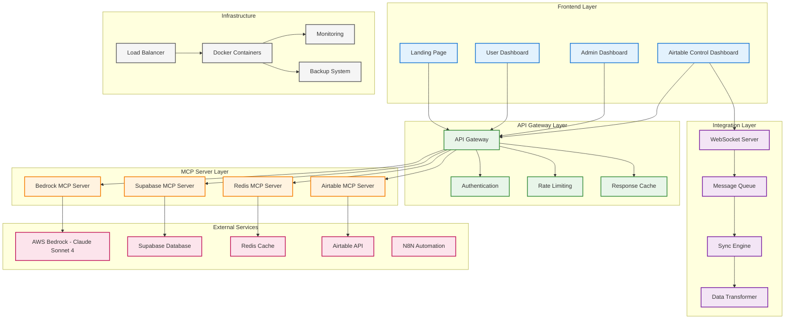

# SME Boost Platform - Complete Project Overview

## Executive Summary

The SME Boost Platform is a comprehensive AI-powered business automation and data management solution designed specifically for small and medium enterprises. The platform integrates cutting-edge AI capabilities with robust data management tools, featuring a specialized Airtable Control Dashboard that serves as the central hub for all data operations.

## Project Architecture Overview



## Core Components

### 1. Airtable Control Dashboard (Primary Focus)

The Airtable Control Dashboard is the centerpiece of the platform, providing comprehensive data management capabilities:

#### Key Features:
- **Complete Data Management**: Full CRUD operations with advanced validation
- **Import/Export System**: Multi-format support with intelligent mapping
- **Two-Way Sync**: Real-time bidirectional synchronization
- **Schema Management**: Visual schema design and relationship mapping
- **Analytics Dashboard**: Performance metrics and usage analytics

#### Technical Implementation:
```typescript
interface AirtableControlDashboard {
  dataManagement: {
    operations: ['create', 'read', 'update', 'delete'];
    bulkOperations: boolean;
    validation: ValidationEngine;
    versioning: VersionControl;
  };
  
  importExport: {
    formats: ['csv', 'json', 'xlsx', 'xml'];
    smartMapping: AIFieldMapping;
    scheduling: AutomatedImports;
    transformation: DataTransformer;
  };
  
  synchronization: {
    type: 'bidirectional';
    realTime: boolean;
    conflictResolution: ConflictResolver;
    monitoring: SyncMonitor;
  };
  
  analytics: {
    performance: PerformanceMetrics;
    usage: UsageAnalytics;
    dataQuality: QualityMetrics;
    customReports: ReportBuilder;
  };
}
```

### 2. MCP Server Infrastructure

#### Bedrock MCP Server
- **Purpose**: AI-powered data processing and insights
- **Model**: Claude Sonnet 4 integration
- **Features**: Batch processing, intelligent data analysis, content generation

#### Supabase MCP Server
- **Purpose**: Authentication and database operations
- **Features**: User management, real-time subscriptions, file storage

#### Redis MCP Server
- **Purpose**: Caching and session management
- **Features**: High-performance caching, session storage, real-time features

#### Airtable MCP Server
- **Purpose**: Direct Airtable API integration
- **Features**: Complete API coverage, rate limiting, error handling

### 3. Frontend Implementation

#### Landing Page Design
```tsx
// Key Components
const LandingPage = () => (
  <div>
    <HeroSection />
    <InteractiveDemo />
    <ProjectValidation />
    <FeatureShowcase />
    <CallToAction />
  </div>
);
```

#### Dashboard Components
```tsx
// Main Dashboard Structure
const Dashboard = () => (
  <DashboardLayout>
    <DataManagement />
    <SyncConfiguration />
    <Analytics />
    <FieldManagement />
  </DashboardLayout>
);
```

## Development Phases

### Phase 1: Foundation (Completed)
- [x] Project architecture design
- [x] MCP server implementation
- [x] Docker containerization
- [x] Basic API integration
- [x] Environment configuration

### Phase 2: Core Features (In Progress)
- [x] Airtable SDK development
- [x] Basic CRUD operations
- [ ] Import/export system
- [ ] Field management
- [ ] Data validation

### Phase 3: Advanced Features (Planned)
- [ ] Two-way sync engine
- [ ] AI-powered insights
- [ ] Advanced analytics
- [ ] Workflow automation
- [ ] Performance optimization

### Phase 4: Integration & Testing (Planned)
- [ ] Platform integration
- [ ] Comprehensive testing
- [ ] Security auditing
- [ ] Performance tuning
- [ ] Documentation completion

### Phase 5: Deployment & Monitoring (Planned)
- [ ] Production deployment
- [ ] Monitoring setup
- [ ] Backup systems
- [ ] Support documentation
- [ ] User training

## Technical Specifications

### Performance Requirements
```yaml
response_times:
  page_load: "<2s"
  api_calls: "<500ms"
  bulk_operations: "<5s per 1000 records"
  real_time_sync: "<1s delay"

scalability:
  concurrent_users: "100+"
  records_per_table: "100,000+"
  operations_per_second: "50+"
  sync_frequency: "every 5 minutes"
```

### Security Implementation
```yaml
authentication:
  type: "JWT + Session"
  mfa: true
  expiry: "24h"
  refresh: true

authorization:
  rbac: true
  field_level: true
  audit_logging: true

encryption:
  data_at_rest: "AES-256"
  data_in_transit: "TLS 1.3"
  field_level: "selective"
```

## Integration Points

### External Service Integrations
1. **AWS Bedrock**: AI model access and processing
2. **Supabase**: Authentication and database services
3. **Redis**: Caching and real-time features
4. **Airtable**: Primary data source and destination
5. **N8N**: Workflow automation (future)

### API Endpoints
```yaml
airtable_control:
  - GET /api/airtable/bases
  - GET /api/airtable/tables/{baseId}
  - POST /api/airtable/records/{baseId}/{tableId}
  - PUT /api/airtable/records/{baseId}/{tableId}/{recordId}
  - DELETE /api/airtable/records/{baseId}/{tableId}/{recordId}

sync_management:
  - POST /api/sync/configure
  - GET /api/sync/status/{syncId}
  - POST /api/sync/start/{syncId}
  - POST /api/sync/stop/{syncId}

analytics:
  - GET /api/analytics/performance
  - GET /api/analytics/usage
  - GET /api/analytics/data-quality
```

## Deployment Strategy

### Development Environment
```yaml
infrastructure:
  - Docker Compose
  - Local Redis instance
  - Development databases
  - Hot reload enabled

services:
  - Frontend: Next.js dev server
  - Backend: Node.js with nodemon
  - Database: PostgreSQL
  - Cache: Redis
```

### Production Environment
```yaml
infrastructure:
  - Kubernetes cluster
  - Load balancer (Nginx)
  - Auto-scaling enabled
  - Health monitoring

services:
  - Frontend: Static build + CDN
  - Backend: Containerized services
  - Database: Managed PostgreSQL
  - Cache: Redis cluster
```

## Success Metrics

### Technical KPIs
- **Uptime**: 99.9%
- **Response Time**: <500ms average
- **Error Rate**: <0.1%
- **Data Accuracy**: 99.9%

### Business KPIs
- **User Adoption**: 90% of SME Boost users
- **Time Savings**: 50% reduction in data management time
- **Data Quality**: 95% accuracy and completeness
- **Customer Satisfaction**: 4.5+ rating

## Risk Management

### Technical Risks
1. **API Rate Limits**: Implement intelligent rate limiting and caching
2. **Data Consistency**: Use transaction management and conflict resolution
3. **Performance**: Implement caching, optimization, and monitoring
4. **Security**: Regular audits, encryption, and access controls

### Business Risks
1. **User Adoption**: Comprehensive training and documentation
2. **Data Migration**: Careful planning and testing
3. **Integration Complexity**: Phased rollout and testing
4. **Scalability**: Cloud-native architecture and auto-scaling

## Future Enhancements

### Short-term (3-6 months)
- Advanced AI insights and recommendations
- Enhanced workflow automation
- Mobile application
- Advanced reporting features

### Long-term (6-12 months)
- Machine learning model training
- Predictive analytics
- Multi-tenant architecture
- Enterprise features

## Conclusion

The SME Boost Platform represents a comprehensive solution for modern business data management, with the Airtable Control Dashboard serving as its cornerstone. The platform's architecture ensures scalability, security, and performance while providing an intuitive user experience that empowers small and medium enterprises to leverage AI and automation for business growth.

The implementation follows industry best practices and modern development methodologies, ensuring a robust, maintainable, and extensible platform that can evolve with changing business needs.

---

**Project Status**: Active Development
**Last Updated**: January 2025
**Next Milestone**: Phase 2 Completion - Core Features Implementation
