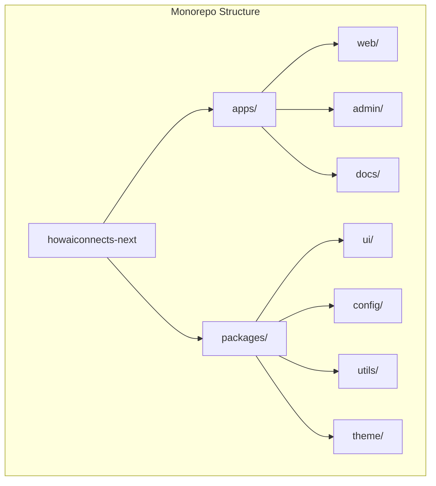

# HowAIConnects.com Build Instructions

## Project Structure



## Template Repositories to Clone

### 1. Base Templates
```bash
# Main website template (Taxonomy)
git clone https://github.com/shadcn-ui/taxonomy.git templates/web

# Admin dashboard (Next.js 15 Dashboard)
git clone https://github.com/vercel/nextjs-dashboard.git templates/admin

# Documentation site (Nextra)
git clone https://github.com/shuding/nextra.git templates/docs
```

## Theme and Styling

### Color Palette
```typescript
// packages/theme/src/colors.ts
export const colors = {
  primary: {
    50: '#f0f9ff',
    100: '#e0f2fe',
    200: '#bae6fd',
    300: '#7dd3fc',
    400: '#38bdf8',
    500: '#0ea5e9',  // Primary brand color
    600: '#0284c7',
    700: '#0369a1',
    800: '#075985',
    900: '#0c4a6e',
  },
  secondary: {
    50: '#f5f3ff',
    100: '#ede9fe',
    200: '#ddd6fe',
    300: '#c4b5fd',
    400: '#a78bfa',
    500: '#8b5cf6',  // Secondary brand color
    600: '#7c3aed',
    700: '#6d28d9',
    800: '#5b21b6',
    900: '#4c1d95',
  },
  accent: {
    50: '#fff1f2',
    100: '#ffe4e6',
    200: '#fecdd3',
    300: '#fda4af',
    400: '#fb7185',
    500: '#f43f5e',  // Accent color
    600: '#e11d48',
    700: '#be123c',
    800: '#9f1239',
    900: '#881337',
  }
}
```

### Typography System
```typescript
// packages/theme/src/typography.ts
export const typography = {
  fonts: {
    heading: 'Cal Sans, sans-serif',
    body: 'Inter, system-ui, sans-serif',
    mono: 'JetBrains Mono, monospace',
  },
  fontSizes: {
    xs: '0.75rem',
    sm: '0.875rem',
    base: '1rem',
    lg: '1.125rem',
    xl: '1.25rem',
    '2xl': '1.5rem',
    '3xl': '1.875rem',
    '4xl': '2.25rem',
    '5xl': '3rem',
  },
  fontWeights: {
    normal: 400,
    medium: 500,
    semibold: 600,
    bold: 700,
  },
}
```

## Component Library Structure

```typescript
// packages/ui/src/index.ts
export * from './components/button'
export * from './components/card'
export * from './components/input'
// ... other component exports

// Example component structure
// packages/ui/src/components/button.tsx
import { cva } from 'class-variance-authority'
import { cn } from '../utils'

const buttonVariants = cva(
  'inline-flex items-center justify-center rounded-md text-sm font-medium transition-colors focus-visible:outline-none focus-visible:ring-2 focus-visible:ring-ring focus-visible:ring-offset-2 disabled:opacity-50 disabled:pointer-events-none ring-offset-background',
  {
    variants: {
      variant: {
        default: 'bg-primary text-primary-foreground hover:bg-primary/90',
        destructive: 'bg-destructive text-destructive-foreground hover:bg-destructive/90',
        outline: 'border border-input hover:bg-accent hover:text-accent-foreground',
        secondary: 'bg-secondary text-secondary-foreground hover:bg-secondary/80',
        ghost: 'hover:bg-accent hover:text-accent-foreground',
        link: 'underline-offset-4 hover:underline text-primary',
      },
      size: {
        default: 'h-10 py-2 px-4',
        sm: 'h-9 px-3 rounded-md',
        lg: 'h-11 px-8 rounded-md',
      },
    },
    defaultVariants: {
      variant: 'default',
      size: 'default',
    },
  }
)
```

## Page Templates

### Landing Page
```typescript
// apps/web/src/pages/index.tsx
import { Hero, Features, CaseStudies, Testimonials, CTA } from '@/components'

export default function Home() {
  return (
    <div>
      <Hero
        title="Transform Your Business with AI"
        subtitle="Leverage the power of artificial intelligence to streamline operations, boost productivity, and drive growth."
        cta="Get Started"
      />
      <Features
        title="Our Solutions"
        features={[
          {
            title: 'AI Consultation',
            description: 'Expert guidance on implementing AI in your business',
            icon: 'brain',
          },
          // ... more features
        ]}
      />
      <CaseStudies
        title="Success Stories"
        studies={[
          {
            title: 'Manufacturing Optimization',
            description: '50% reduction in production errors',
            industry: 'Manufacturing',
          },
          // ... more case studies
        ]}
      />
      <Testimonials />
      <CTA
        title="Ready to Transform Your Business?"
        subtitle="Join hundreds of businesses already benefiting from our AI solutions"
        buttonText="Schedule a Consultation"
      />
    </div>
  )
}
```

### Dashboard Layout
```typescript
// apps/admin/src/components/layout.tsx
import { Sidebar, Header, Footer } from '@/components'

export function DashboardLayout({ children }) {
  return (
    <div className="min-h-screen bg-background">
      <Header />
      <div className="flex">
        <Sidebar />
        <main className="flex-1 p-6">
          {children}
        </main>
      </div>
      <Footer />
    </div>
  )
}
```

## Routing Structure

```typescript
// apps/web/src/app/routes.ts
export const routes = {
  home: '/',
  services: {
    index: '/services',
    aiConsulting: '/services/ai-consulting',
    automation: '/services/automation',
    dataAnalytics: '/services/data-analytics',
  },
  solutions: {
    index: '/solutions',
    enterprise: '/solutions/enterprise',
    smallBusiness: '/solutions/small-business',
    startup: '/solutions/startup',
  },
  resources: {
    index: '/resources',
    blog: '/resources/blog',
    casestudies: '/resources/case-studies',
    documentation: '/resources/docs',
  },
  about: {
    index: '/about',
    team: '/about/team',
    careers: '/about/careers',
    contact: '/about/contact',
  },
}
```

## Setup Instructions

1. Clone the repository structure:
```bash
# Create project directory
mkdir howaiconnects-next
cd howaiconnects-next

# Initialize monorepo
pnpm init
pnpm add -D turbo @turbo/gen

# Create workspace structure
mkdir -p apps/{web,admin,docs}
mkdir -p packages/{ui,theme,config,utils}
```

2. Clone and integrate templates:
```bash
# Clone templates
git clone https://github.com/shadcn-ui/taxonomy.git templates/web
git clone https://github.com/vercel/nextjs-dashboard.git templates/admin
git clone https://github.com/shuding/nextra.git templates/docs

# Copy template files to project structure
cp -r templates/web/* apps/web/
cp -r templates/admin/* apps/admin/
cp -r templates/docs/* apps/docs/
```

3. Set up shared packages:
```bash
# UI Components
cp -r templates/web/components/* packages/ui/src/
cp -r templates/web/styles/* packages/theme/src/

# Configuration
cp -r templates/web/config/* packages/config/src/

# Utilities
cp -r templates/web/lib/* packages/utils/src/
```

4. Configure package.json files:
```bash
# Root package.json
cat > package.json << EOL
{
  "name": "howaiconnects",
  "private": true,
  "scripts": {
    "build": "turbo run build",
    "dev": "turbo run dev",
    "lint": "turbo run lint",
    "format": "prettier --write \"**/*.{ts,tsx,md}\""
  },
  "devDependencies": {
    "@turbo/gen": "^1.10.12",
    "prettier": "^3.0.3",
    "turbo": "^1.10.12"
  },
  "packageManager": "pnpm@8.9.0"
}
EOL

# Create turbo.json
cat > turbo.json << EOL
{
  "$schema": "https://turbo.build/schema.json",
  "globalDependencies": ["**/.env.*local"],
  "pipeline": {
    "build": {
      "dependsOn": ["^build"],
      "outputs": [".next/**", "!.next/cache/**"]
    },
    "lint": {},
    "dev": {
      "cache": false,
      "persistent": true
    }
  }
}
EOL
```

5. Install dependencies:
```bash
pnpm install
```

6. Start development:
```bash
pnpm dev
```

## Key Features to Implement

1. AI Service Integration
   - OpenAI API integration
   - AWS Bedrock integration
   - Custom AI model deployment

2. Business Logic
   - Service booking system
   - Consultation scheduling
   - Project management
   - Client communication

3. Analytics and Reporting
   - Business metrics dashboard
   - AI performance monitoring
   - ROI calculations
   - Client success tracking

4. Content Management
   - Blog system
   - Case studies
   - Documentation
   - Resource library

## Development Guidelines

1. **Code Style**
   - Follow TypeScript best practices
   - Use functional components
   - Implement proper error handling
   - Write comprehensive tests

2. **Performance**
   - Implement code splitting
   - Optimize images and assets
   - Use proper caching strategies
   - Monitor and optimize bundle size

3. **Security**
   - Implement proper authentication
   - Use secure API endpoints
   - Follow OWASP guidelines
   - Regular security audits

4. **Accessibility**
   - Follow WCAG 2.1 guidelines
   - Implement proper ARIA labels
   - Ensure keyboard navigation
   - Test with screen readers

## Deployment Strategy

1. **Development**
   - Local development using pnpm
   - Hot reloading enabled
   - Environment variable management

2. **Staging**
   - Vercel Preview deployments
   - Integration testing
   - Performance testing

3. **Production**
   - Vercel Production deployment
   - CDN configuration
   - SSL certificates
   - Monitoring setup

## Monitoring and Analytics

1. **Performance Monitoring**
   - Vercel Analytics
   - Custom performance metrics
   - Error tracking
   - User behavior analytics

2. **Business Metrics**
   - Conversion tracking
   - User engagement
   - Service usage
   - Revenue metrics

This guide provides a comprehensive foundation for building HowAIConnects.com using modern Next.js 15 templates and best practices. Follow these instructions to maintain consistency and quality throughout the development process.
