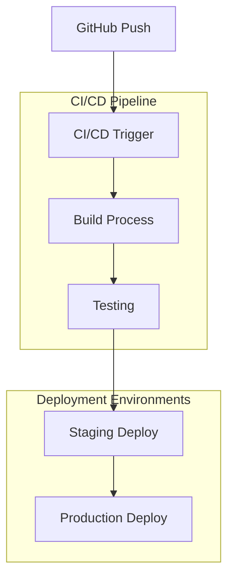

# Post-Commit Deployment Guide

## 1. Deployment Pipeline Overview



## 2. Immediate Post-Push Actions

### 2.1 Verify GitHub Actions
```bash
# Check workflow status
gh workflow list
gh run list --workflow=".github/workflows/main.yml"

# Monitor specific workflow
gh run watch
```

### 2.2 Environment Validation
```bash
# Staging Environment
curl https://staging-api.sme-boost.com/health
curl https://staging.sme-boost.com/api/status

# Production Environment
curl https://api.sme-boost.com/health
curl https://sme-boost.com/api/status
```

## 3. Digital Ocean Deployment

### 3.1 Container Registry Update
```bash
# Tag and push Docker images
docker tag sme-boost-mcp:latest registry.digitalocean.com/sme-boost/mcp:latest
docker push registry.digitalocean.com/sme-boost/mcp:latest

# Verify image deployment
doctl registry repository list-tags sme-boost/mcp
```

### 3.2 Kubernetes Deployment
```bash
# Update Kubernetes deployments
kubectl apply -f k8s/staging/
kubectl apply -f k8s/production/

# Monitor rollout
kubectl rollout status deployment/mcp-servers
kubectl rollout status deployment/airtable-control
```

## 4. Database Migrations

### 4.1 Supabase Updates
```bash
# Run migrations
supabase db push

# Verify migration status
supabase db status
```

### 4.2 Redis Cache Clear
```bash
# Clear staging cache
redis-cli -h staging-redis.sme-boost.com FLUSHALL

# Clear production cache (if needed)
redis-cli -h prod-redis.sme-boost.com FLUSHALL
```

## 5. Post-Deployment Verification

### 5.1 API Health Checks
```typescript
const endpoints = [
  '/api/health',
  '/api/airtable/status',
  '/api/mcp/status',
  '/api/sync/status'
];

async function verifyEndpoints(environment: 'staging' | 'production') {
  const baseUrl = environment === 'staging' 
    ? 'https://staging-api.sme-boost.com'
    : 'https://api.sme-boost.com';

  for (const endpoint of endpoints) {
    const response = await fetch(`${baseUrl}${endpoint}`);
    console.log(`${endpoint}: ${response.status}`);
  }
}
```

### 5.2 Integration Tests
```bash
# Run integration test suite
npm run test:integration:staging
npm run test:integration:prod
```

## 6. Monitoring Setup

### 6.1 Log Aggregation
```bash
# Verify log shipping
kubectl logs -f deployment/fluentd-aggregator

# Check log indices
curl -X GET "localhost:9200/_cat/indices?v"
```

### 6.2 Metrics Collection
```bash
# Verify Prometheus targets
curl localhost:9090/api/v1/targets

# Check Grafana dashboards
curl -X GET "localhost:3000/api/dashboards"
```

## 7. Performance Monitoring

### 7.1 Frontend Performance
```typescript
interface PerformanceMetrics {
  ttfb: number;        // Time to First Byte
  fcp: number;         // First Contentful Paint
  lcp: number;         // Largest Contentful Paint
  cls: number;         // Cumulative Layout Shift
  fid: number;         // First Input Delay
}

// Monitor key metrics
async function checkPerformance(environment: string) {
  const metrics = await lighthouse.getMetrics(`https://${environment}.sme-boost.com`);
  console.table(metrics);
}
```

### 7.2 Backend Performance
```bash
# Check API response times
ab -n 1000 -c 50 https://api.sme-boost.com/health

# Monitor database performance
pgmetrics -host staging-db.sme-boost.com -port 5432
```

## 8. Security Verification

### 8.1 Security Headers
```bash
# Verify security headers
curl -I https://sme-boost.com | grep -i "security"
curl -I https://api.sme-boost.com | grep -i "security"
```

### 8.2 SSL Certificate Check
```bash
# Check SSL certificates
openssl s_client -connect sme-boost.com:443
openssl s_client -connect api.sme-boost.com:443
```

## 9. Rollback Procedures

### 9.1 Quick Rollback
```bash
# Kubernetes rollback
kubectl rollout undo deployment/mcp-servers
kubectl rollout undo deployment/airtable-control

# Docker image rollback
docker tag registry.digitalocean.com/sme-boost/mcp:previous registry.digitalocean.com/sme-boost/mcp:latest
docker push registry.digitalocean.com/sme-boost/mcp:latest
```

### 9.2 Database Rollback
```sql
-- Revert last migration
BEGIN;
  SELECT revert_last_migration();
COMMIT;
```

## 10. Documentation Update

### 10.1 API Documentation
```bash
# Generate updated API docs
npm run generate:docs

# Deploy to documentation site
npm run deploy:docs
```

### 10.2 Changelog Update
```markdown
## [Version X.Y.Z] - YYYY-MM-DD

### Added
- New feature descriptions
- API endpoint additions

### Changed
- Modified functionality
- Updated dependencies

### Fixed
- Bug fixes
- Performance improvements
```

## 11. Communication

### 11.1 Team Notification
```typescript
interface DeploymentNotification {
  version: string;
  environment: 'staging' | 'production';
  status: 'success' | 'failed';
  changes: string[];
  rollbackPlan?: string;
}

async function notifyTeam(notification: DeploymentNotification) {
  // Send to Slack
  await slack.send(notification);
  
  // Send to Email
  await email.send(notification);
}
```

### 11.2 Status Page Update
```typescript
interface StatusUpdate {
  component: string;
  status: 'operational' | 'degraded' | 'outage';
  message: string;
}

async function updateStatus(update: StatusUpdate) {
  await statusPage.createIncident(update);
}
```

## 12. Next Steps

### 12.1 Monitoring Period
- Monitor error rates for 24 hours
- Watch performance metrics
- Track user feedback
- Monitor integration points

### 12.2 Follow-up Tasks
- Schedule performance review
- Plan optimization improvements
- Update documentation
- Review security logs

---

**Note**: This guide should be followed after each successful push to the GitHub repository to ensure proper deployment and system stability.
