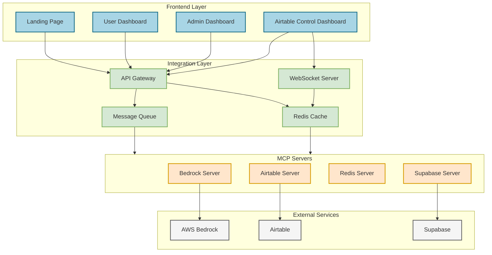
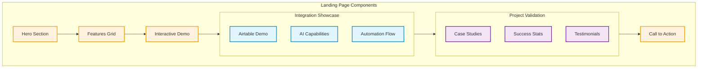
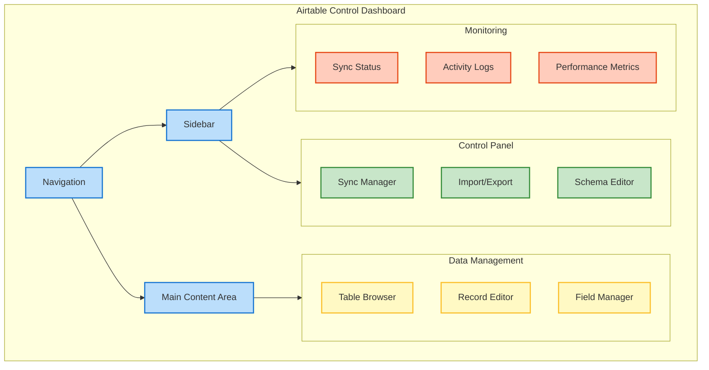
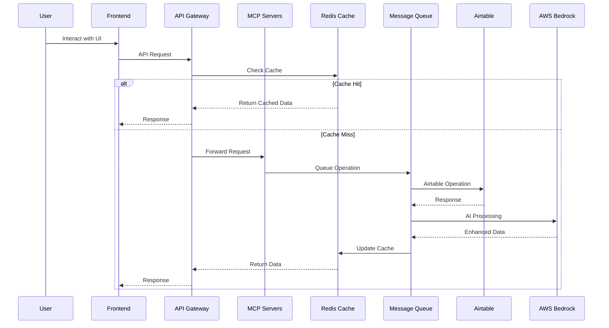

# SME Boost Platform - System Architecture

## System Overview Diagram



Note: The "Frontend Layer" also includes a Prompt Management Dashboard (PMD), which is based on the Latitude platform. The local codebase and detailed documentation for Latitude can be found in the project root at `/latitude-llm-docs-source/`. For a more detailed architecture including the PMD, please refer to the `COMPLETE_PROJECT_OVERVIEW.md` document.

## Detailed Component Architecture

### Landing Page Structure



### Airtable Control Dashboard



## Data Flow Architecture



## Frontend Component Details

### Landing Page Components

```typescript
// Hero Section
interface HeroSection {
  headline: string;
  subheadline: string;
  ctaButton: {
    text: string;
    action: () => void;
  };
  demoVideo: {
    url: string;
    thumbnail: string;
  };
}

// Features Grid
interface Feature {
  icon: string;
  title: string;
  description: string;
  demoLink?: string;
}

// Interactive Demo
interface DemoComponent {
  steps: Array<{
    title: string;
    description: string;
    action: () => void;
    validation: () => boolean;
  }>;
  livePreview: boolean;
  resetDemo: () => void;
}

// Project Validation
interface ValidationSection {
  caseStudies: Array<{
    company: string;
    challenge: string;
    solution: string;
    results: string[];
  }>;
  statistics: Array<{
    metric: string;
    value: number;
    change: number;
  }>;
  testimonials: Array<{
    quote: string;
    author: string;
    company: string;
    image: string;
  }>;
}
```

### Dashboard Components

```typescript
// Main Dashboard Layout
interface DashboardLayout {
  navigation: {
    primary: MenuItem[];
    secondary: MenuItem[];
  };
  sidebar: {
    width: number;
    collapsible: boolean;
  };
  content: {
    maxWidth: number;
    padding: number;
  };
}

// Control Panel
interface ControlPanel {
  syncManager: {
    status: SyncStatus;
    controls: SyncControls;
    history: SyncHistory[];
  };
  importExport: {
    supported: FileFormat[];
    mapping: FieldMapping;
    validation: ValidationRules;
  };
  schemaEditor: {
    tables: TableSchema[];
    relationships: Relationship[];
    validation: SchemaValidation;
  };
}

// Data Management
interface DataManagement {
  tableBrowser: {
    view: 'grid' | 'kanban' | 'calendar';
    filters: Filter[];
    sorting: Sort[];
    pagination: Pagination;
  };
  recordEditor: {
    mode: 'single' | 'bulk';
    validation: ValidationRules;
    history: ChangeHistory[];
  };
  fieldManager: {
    types: FieldType[];
    options: FieldOptions;
    computed: ComputedField[];
  };
}
```

## Style Guide

### Color Palette
```scss
// Primary Colors
$primary-50: #e3f2fd;
$primary-100: #bbdefb;
$primary-500: #2196f3;
$primary-700: #1976d2;
$primary-900: #0d47a1;

// Secondary Colors
$secondary-50: #e8f5e9;
$secondary-100: #c8e6c9;
$secondary-500: #4caf50;
$secondary-700: #388e3c;
$secondary-900: #1b5e20;

// Accent Colors
$accent-50: #fff3e0;
$accent-100: #ffe0b2;
$accent-500: #ff9800;
$accent-700: #f57c00;
$accent-900: #e65100;

// Neutral Colors
$neutral-50: #fafafa;
$neutral-100: #f5f5f5;
$neutral-500: #9e9e9e;
$neutral-700: #616161;
$neutral-900: #212121;
```

### Typography
```scss
// Font Families
$font-primary: 'Inter', sans-serif;
$font-secondary: 'Poppins', sans-serif;
$font-mono: 'JetBrains Mono', monospace;

// Font Sizes
$text-xs: 0.75rem;    // 12px
$text-sm: 0.875rem;   // 14px
$text-base: 1rem;     // 16px
$text-lg: 1.125rem;   // 18px
$text-xl: 1.25rem;    // 20px
$text-2xl: 1.5rem;    // 24px
$text-3xl: 1.875rem;  // 30px
$text-4xl: 2.25rem;   // 36px
```

### Component Spacing
```scss
// Spacing Scale
$space-1: 0.25rem;   // 4px
$space-2: 0.5rem;    // 8px
$space-3: 0.75rem;   // 12px
$space-4: 1rem;      // 16px
$space-6: 1.5rem;    // 24px
$space-8: 2rem;      // 32px
$space-12: 3rem;     // 48px
$space-16: 4rem;     // 64px
```

## Responsive Design

### Breakpoints
```scss
$breakpoints: (
  'sm': 640px,   // Mobile devices
  'md': 768px,   // Tablets
  'lg': 1024px,  // Laptops
  'xl': 1280px,  // Desktops
  '2xl': 1536px  // Large screens
);
```

### Grid System
```scss
.grid {
  display: grid;
  grid-template-columns: repeat(12, 1fr);
  gap: $space-4;

  @media (max-width: map-get($breakpoints, 'md')) {
    grid-template-columns: repeat(6, 1fr);
  }

  @media (max-width: map-get($breakpoints, 'sm')) {
    grid-template-columns: repeat(4, 1fr);
  }
}
```

This architecture document provides a comprehensive overview of the system's structure, with special focus on the frontend components and their relationships. The Mermaid diagrams help visualize the connections between different parts of the system, while the detailed component specifications ensure consistent implementation across the platform.
