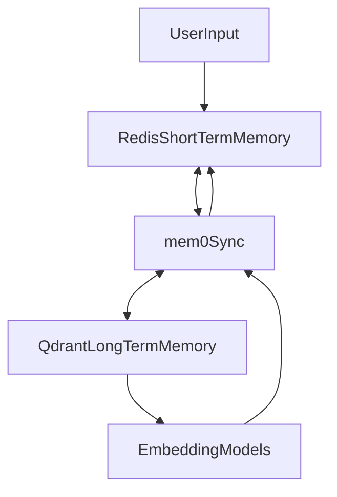
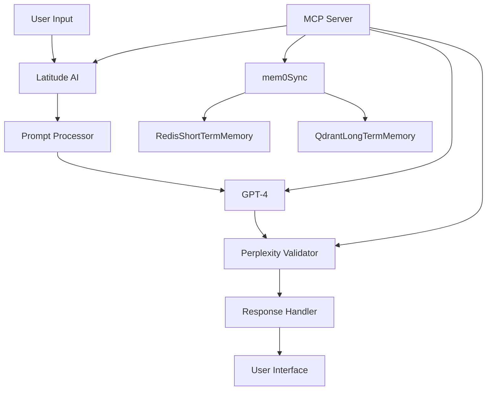

# API Integration and MCP Server Guide

## 1. Latitude AI Integration

### Prompt Management Flow
```python
# Example prompt management flow
async def handle_immigration_prompt(user_input: str):
    # 1. Initial prompt processing with Latitude AI
    latitude_prompt = await latitude_client.process_prompt(
        input_text=user_input,
        context="immigration_assistance"
    )
    
    # 2. Validate and enhance prompt
    enhanced_prompt = await prompt_validator.validate(latitude_prompt)
    
    # 3. Generate response using GPT
    gpt_response = await openai_client.generate(enhanced_prompt)
    
    # 4. Validate response with Perplexity
    validated_response = await perplexity_client.validate_response(
        original_prompt=enhanced_prompt,
        response=gpt_response,
        model="sonar-large-research"
    )
    
    return validated_response
```

## 2. FastAPI Integration

### API Structure
```python
from fastapi import FastAPI, HTTPException
from pydantic import BaseModel

app = FastAPI()

class PromptRequest(BaseModel):
    user_input: str
    context: dict

@app.post("/api/v1/immigration/ask")
async def process_immigration_query(request: PromptRequest):
    try:
        # Process through Latitude AI
        latitude_response = await latitude_service.process(request.user_input)
        
        # Validate with Perplexity
        validated_response = await perplexity_service.validate(
            latitude_response,
            context=request.context
        )
        
        return validated_response
    except Exception as e:
        raise HTTPException(status_code=500, detail=str(e))
```

## 3. MCP Server Options

### Option 1: Managed MCP Services
1. **AWS MCP Server**
   - Pros: Managed service, high availability, scalable
   - Cons: Higher cost, vendor lock-in
   - Setup:
     ```yaml
     aws_mcp:
       region: us-east-1
       instance_type: t3.large
       auto_scaling: true
       connections:
         - latitude_ai
         - perplexity
         - openai
     ```

2. **Google Cloud MCP**
   - Pros: Good integration with AI services
   - Cons: Complex setup
   - Setup:
     ```yaml
     gcp_mcp:
       zone: us-central1
       machine_type: n2-standard-2
       connections:
         - latitude_ai
         - perplexity
         - openai
     ```

3. **Azure MCP**
   - Pros: Strong enterprise features
   - Cons: Higher cost
   - Setup:
     ```yaml
     azure_mcp:
       location: eastus
       vm_size: Standard_DS2_v2
       connections:
         - latitude_ai
         - perplexity
         - openai
     ```

### Option 2: Self-Hosted MCP Server

#### Requirements
- Dedicated server with minimum specifications:
  - 8 CPU cores
  - 16GB RAM
  - 100GB SSD
  - Ubuntu 20.04 LTS

#### Setup Instructions
```bash
# 1. Install MCP Server
git clone https://github.com/mcp-server/core
cd core
./install.sh

# 2. Configure Services
cat << EOF > config/services.yaml
services:
  - name: latitude_ai
    endpoint: https://api.latitude.ai
    api_key: ${LATITUDE_API_KEY}
  
  - name: perplexity
    endpoint: https://api.perplexity.ai
    model: sonar-large-research
    api_key: ${PERPLEXITY_API_KEY}
  
  - name: openai
    endpoint: https://api.openai.com/v1
    api_key: ${OPENAI_API_KEY}
EOF

# 3. Start MCP Server
./mcp-server start
```

## 4. Perplexity API Integration

### Response Validation Flow
```python
class PerplexityValidator:
    def __init__(self, api_key: str):
        self.client = PerplexityClient(api_key)
        self.model = "sonar-large-research"
    
    async def validate_response(
        self,
        original_prompt: str,
        response: str,
        context: dict
    ) -> ValidatedResponse:
        # Deep research validation
        validation_result = await self.client.validate(
            text=response,
            model=self.model,
            context=context,
            validation_type="deep_research"
        )
        
        if validation_result.confidence < 0.95:
            # Reprocess with additional context
            return await self.reprocess_response(
                original_prompt,
                response,
                validation_result.suggestions
            )
        
        return ValidatedResponse(
            content=response,
            confidence=validation_result.confidence,
            sources=validation_result.sources
        )
```

## 5. Memory Integration with mem0, Redis, and Qdrant

### Architecture Overview
- **Short-term Memory**: Managed using Redis Cloud for fast access and session management.
- **Medium and Long-term Memory**: Managed using Qdrant vector database with integrated embedding models.
- **Two-way Sync**: mem0 handles synchronization between Redis and Qdrant to maintain consistency.

### Integration Flow


### Implementation Notes
- Use Redis for storing recent conversation context and session data.
- Use Qdrant for semantic search and retrieval of long-term knowledge.
- mem0 acts as the middleware to synchronize embeddings and data between Redis and Qdrant.
- Embedding models generate vector representations for both short-term and long-term memory data.

## 6. Integration Architecture



## 7. Security Considerations

1. **API Key Management**
   ```python
   from cryptography.fernet import Fernet
   
   class SecureKeyManager:
       def __init__(self):
           self.key = Fernet.generate_key()
           self.cipher_suite = Fernet(self.key)
           
       def encrypt_api_key(self, api_key: str) -> bytes:
           return self.cipher_suite.encrypt(api_key.encode())
           
       def decrypt_api_key(self, encrypted_key: bytes) -> str:
           return self.cipher_suite.decrypt(encrypted_key).decode()
   ```

2. **Request Validation**
   ```python
   from fastapi import Security, Depends
   from fastapi.security import APIKeyHeader
   
   api_key_header = APIKeyHeader(name="X-API-Key")
   
   async def validate_api_key(api_key: str = Security(api_key_header)):
       if not is_valid_api_key(api_key):
           raise HTTPException(
               status_code=403,
               detail="Invalid API key"
           )
       return api_key
   ```

## 8. Monitoring and Logging

```python
import logging
from opentelemetry import trace
from prometheus_client import Counter, Histogram

# Metrics
prompt_counter = Counter(
    'immigration_prompts_total',
    'Total number of immigration prompts processed'
)

response_time = Histogram(
    'response_time_seconds',
    'Time spent processing immigration queries'
)

# Logging
logger = logging.getLogger(__name__)

async def log_prompt_metrics(prompt: str, response: str, duration: float):
    prompt_counter.inc()
    response_time.observe(duration)
    
    logger.info(
        "Prompt processed",
        extra={
            "duration": duration,
            "prompt_length": len(prompt),
            "response_length": len(response)
        }
    )
```

This guide provides detailed instructions for integrating all required APIs, memory management, and setting up the MCP server. Follow the security considerations and monitoring guidelines for a robust implementation.
