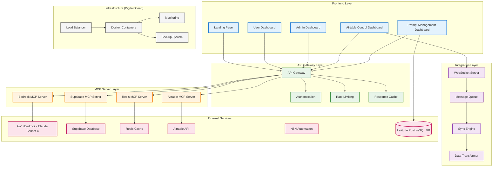
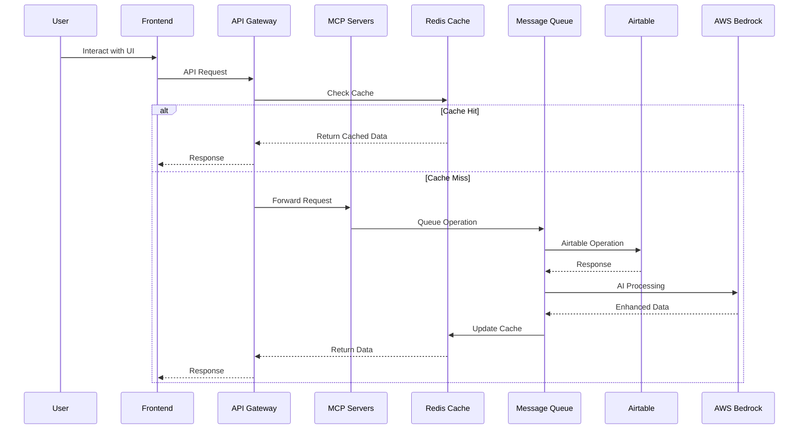

# SME Boost Platform: Comprehensive System Prompt & Master Guide

## 1. Executive Summary

The SME Boost Platform is a comprehensive, AI-powered business automation and data management solution designed for small and medium enterprises (SMEs). It integrates cutting-edge AI capabilities with robust data management tools, featuring a specialized Airtable Control Dashboard as the central hub for data operations and a Latitude-based AI Prompt Management Dashboard for managing AI interactions.

This document serves as the single source of truth for the project's architecture, components, development guidelines, and strategic goals.

## 2. System Architecture

### 2.1. Overall Architecture

The platform is built on a modular, microservices-oriented architecture designed for scalability, maintainability, and performance.



### 2.2. Data Flow Architecture



## 3. Core Components

### 3.1. Airtable Control Dashboard
The centerpiece of the platform, providing comprehensive data management capabilities.
- **Features**: Full CRUD, multi-format import/export, real-time two-way sync, visual schema management, and performance analytics.
- **Tech**: React/Next.js, TypeScript, custom Airtable SDK.

### 3.2. Latitude AI Prompt Management Dashboard (PMD)
A dedicated interface for creating, managing, testing, and versioning AI prompts.
- **Source**: Forked from `latitude-dev/latitude-llm`, located in `/latitude-llm-docs-source/`.
- **Integration Points**:
    - **Authentication**: Integrates with the **Supabase MCP Server**.
    - **Prompt Execution**: Routes test requests through the **Bedrock MCP Server**.
    - **Data Storage**: Uses its own dedicated PostgreSQL database hosted on DigitalOcean.
- **Deployment**: All Latitude components (frontend, backend services) are containerized and deployed on DigitalOcean alongside the main platform.

### 3.3. MCP Server Infrastructure
- **Bedrock MCP Server**: For AI-powered data processing and insights using Claude Sonnet 4.
- **Supabase MCP Server**: Manages user authentication, authorization, and core database operations.
- **Redis MCP Server**: Handles high-performance caching, session management, and real-time features.
- **Airtable MCP Server**: Provides direct, rate-limited, and error-handled integration with the Airtable API.

## 4. Development & Deployment

### 4.1. Development Environment
- **Infrastructure**: Docker Compose, local Redis, development databases.
- **Services**: Next.js dev server (frontend), Node.js with nodemon (backend).
- **Hot Reload**: Enabled for rapid development.

### 4.2. Production Environment
- **Infrastructure**: Hosted on DigitalOcean, using Docker containers, managed databases, and a load balancer (Nginx).
- **Services**: Frontend served via static build + CDN, backend services are containerized.
- **CI/CD**: Automated build, test, and deployment pipeline (details in `POST_COMMIT_DEPLOYMENT.md`).

### 4.3. Latitude Integration Guidelines
- **Codebase**: Work within the `/latitude-llm-docs-source/` directory for all Latitude-specific changes.
- **Documentation**: Refer to `/latitude-llm-docs-source/docs/` for the original Latitude platform documentation.
- **Configuration**: Manage PMD configurations (DB connections, API keys) securely, consistent with other MCP server configs.
- **Dockerization**: Update the main `docker-compose.yml` and `docker-compose.prod.yml` to include services for Latitude's frontend, backend, and its dedicated database.

## 5. Style Guide & UI/UX

### 5.1. Color Palette
```scss
// Primary Colors
$primary-500: #2196f3;
$primary-700: #1976d2;

// Secondary Colors
$secondary-500: #4caf50;
$secondary-700: #388e3c;

// Accent Colors
$accent-500: #ff9800;
$accent-700: #f57c00;

// Neutral Colors
$neutral-500: #9e9e9e;
$neutral-900: #212121;
```

### 5.2. Typography
- **Primary Font**: 'Inter', sans-serif
- **Secondary Font**: 'Poppins', sans-serif
- **Monospace Font**: 'JetBrains Mono', monospace

### 5.3. Consistency
The PMD will largely use Latitude's existing UI but should have styling adjustments to maintain visual consistency with the main SME Boost platform. Navigation between the dashboards must be seamless.

## 6. Security

- **Authentication**: JWT + Session-based authentication managed by Supabase, with MFA enabled.
- **Authorization**: Role-Based Access Control (RBAC) and field-level permissions.
- **Encryption**: Data is encrypted at rest (AES-256) and in transit (TLS 1.3).
- **Auditing**: Comprehensive audit logs for all significant actions.

## 7. Success Metrics & KPIs

- **Technical**: 99.9% uptime, <500ms average API response time, <0.1% error rate.
- **Business**: High user adoption, significant reduction in data management time for clients, high data quality and accuracy.

## 8. Future Enhancements

- **Short-term**: Advanced AI-powered insights, workflow automation via N8N, mobile application.
- **Long-term**: Custom machine learning model training, predictive analytics, multi-tenant architecture.

This master prompt provides a holistic view of the SME Boost Platform. All development, integration, and strategic decisions should align with the principles and specifications outlined herein.
